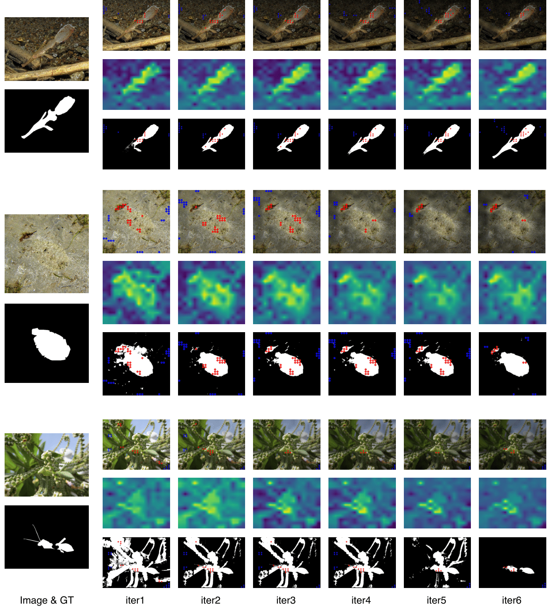
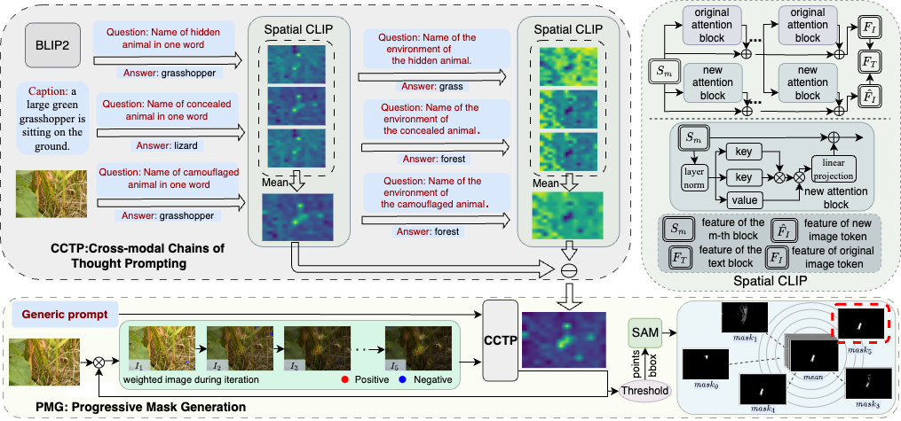

# :fire: GenSAM (AAAI 2024)

Code release of paper:

[**Relax Image-Specific Prompt Requirement in SAM: A Single Generic Prompt for Segmenting Camouflaged Objects**](https://arxiv.org/abs/)

[Jian Hu*](https://lwpyh.github.io/), [Jiayi Lin*](https://scholar.google.com/citations?hl=en&view_op=list_works&gmla=AH70aAW7LfVn82AZckFTh_Y7mXPPLrqDH6LMWDXLBCTbnSLe39ue9Iiza6jy5HDuReAozF5HnWECuq9xlCXrlw&user=l4Fps4EAAAAJ), [Weitong Cai](https://lvgd.github.io/), [Shaogang Gong](http://www.eecs.qmul.ac.uk/~sgg/)

<a href='https://arxiv.org/abs/2312.07374'></a> 
<a href='https://lwpyh.github.io/GenSAM/'></a>

## :rocket: Updates
* **[2023.12.12]** Model running instructions with LLaVA1 and LLaVA1.5 are released.
* **[2023.12.10]** LLaVA1 and LLaVA1.5 version GenSAM on CHAMELEON dataset is realeased.



## :bulb: Highlight

The Segment Anything Model (SAM) shows remarkable segmentation ability with sparse prompts like points. However, manual prompt is not always feasible, as it may not be accessible in real-world application. In this work, we aim to eliminate the need for manual prompt.The key idea is to employ Cross-modal Chains of Thought Prompting (CCTP) to reason visual prompts using the semantic information given by a generic text prompt. We introduce a test-time adaptation per-instance mechanism called Generalizable SAM (GenSAM) to automatically enerate and optimize visual prompts the generic task prompt.

A brief introduction of how we GenSAM do!

CCTP maps a single generic text prompt onto image-specific consensus foreground and background heatmaps using vision-language models, acquiring reliable visual prompts. Moreover, to test-time adapt the visual prompts, we further propose Progressive Mask Generation (PMG) to iteratively reweight the input image, guiding the model to focus on the targets in a coarse-to-fine manner.Crucially, all network parameters are fixed, avoiding the need for additional training.Experiments demonstrate the superiority of GenSAM. Experiments on three benchmarks demonstrate that GenSAM outperforms point supervision approaches and achieves comparable results to scribble supervision ones, solely relying on general task descriptions as prompts.     

## Quick Start
<!-- The prompt-dialogue of varies abilities are saved in [dataset](https://github.com/crystraldo/StableLLAVA/tree/main/dataset). -->

<!-- The synthesized prompt-dialogue datasets of various abilities are saved in [dataset](https://github.com/crystraldo/StableLLAVA/tree/main/dataset). Please follow the steps below to generate datasets with LLaVA format. -->

<!-- 1. Use [SD-XL](https://github.com/crystraldo/StableLLAVA/blob/main/stable_diffusion.py) to generate images as training images. It will take ~13s to generate one image on V100.-->
<!-- python stable_diffusion.py --prompt_path dataset/animal.json --save_path train_set/animal/-->
<!-- 2. Use [data_to_llava](https://github.com/crystraldo/StableLLAVA/blob/main/data_to_llava.py) to convert dataset format for LLaVA model training. -->
<!-- ```
python data_to_llava.py --image_path train_set/ --prompt_path dataset/ --save_path train_ano/
``` -->

### Download Dataset
1. Download the datasets from the follow links:
   
**Camouflaged Object Detection Dataset**
- **[COD10K](https://github.com/DengPingFan/SINet/)**
- **[CAMO](https://drive.google.com/open?id=1h-OqZdwkuPhBvGcVAwmh0f1NGqlH_4B6)**
- **[CHAMELEON](https://www.polsl.pl/rau6/datasets/)**
2. Put it in ./data/.
### Running GenSAM on CHAMELON Dataset with LLaVA1/LLaVA1.5
1. When playing with LLaVA, this code was implemented with Python 3.8 and PyTorch 2.1.0. You can install all the requirements via:
```bash
conda create -n GenSAM_LLaVA python=3.8 -y
conda activate GenSAM_LLaVA
git clone https://github.com/haotian-liu/LLaVA.git
cd LLaVA
pip install -e .
cd ..
pip install git+https://github.com/facebookresearch/segment-anything.git
wget https://dl.fbaipublicfiles.com/segment_anything/sam_vit_h_4b8939.pth
pip install opencv-python
pip install imageio
pip install urllib3==1.26.6
pip install ftfy
```
2. Our GenSAM is a training-free test-time adaptation approach, so you can play with it by running:
```bash
python main.py --config config/CHAMELON_LLaVA1.5.yaml   ###LLaVA1.5
python main.py --config config/CHAMELON_LLaVA.yaml   ###LLaVA
```
if you want to visualize the output picture during test-time adaptation, you can running:
```bash
python main.py --config config/CHAMELON_LLaVA1.5.yaml --visualization    ###LLaVA1.5
python main.py --config config/CHAMELON_LLaVA.yaml --visualization    ###LLaVA
```

 ## TO-DO LIST
- [x] Update datasets and implementation scripts
- [ ] Keep incorporating more capabilities
- [ ] Demo and Codes


## Citation

If you find our work useful in your research, please consider citing:

```
@misc{hu2023relax,
      title={Relax Image-Specific Prompt Requirement in SAM: A Single Generic Prompt for Segmenting Camouflaged Objects}, 
      author={Jian Hu and Jiayi Lin and Weitong Cai and Shaogang Gong},
      year={2023},
      eprint={2312.07374},
      archivePrefix={arXiv},
      primaryClass={cs.CV}
}
```

## :cupid: Acknowledgements

- [Segment Anything](https://github.com/facebookresearch/segment-anything)
- [LLaVA](https://github.com/haotian-liu/LLaVA)
- [CLIP Surgery](https://github.com/xmed-lab/CLIP_Surgery)

